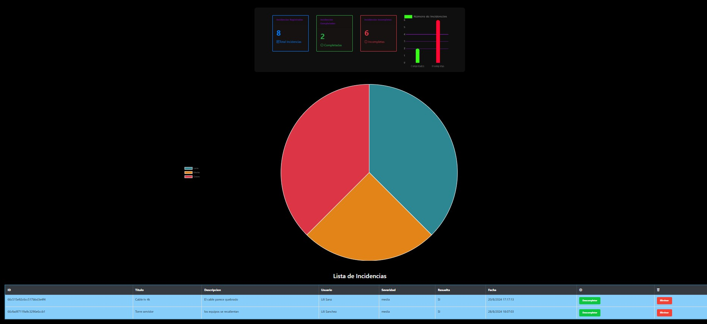

# 🛠️ Incident App – Gestor de Incidencias (Fullstack)


Aplicación web fullstack para el registro, gestión y visualización de incidencias. Permite crear reportes, ver estadísticas en tarjetas y gráficos, y filtrar por estado o severidad.  

---

## 📂 Estructura del proyecto

```plaintext
incident-app/
├── client/ # Frontend (HTML, CSS, JS)
│   ├── index.html # Dashboard con tabla y gráficas
│   ├── incident.html # Formulario para registrar incidencias
│   ├── index.js # Lógica de la tabla
│   ├── dashboard.js # Tarjetas y gráfica de barras
│   ├── graficoPastel.js # Gráfico de pastel
│   └── css/
│       └── style.css # Estilos del frontend
│
├── server/ # Backend (Node.js + Express + MongoDB)
│   ├── app.js # Configuración principal del servidor
│   ├── index.js # Configuración principal de la base de datos
│   ├── models/
│   │   └── incident.js # Modelo Mongoose para las incidencias
│   ├── routes/
│   │   └── incident.js # Endpoints REST (GET, POST, PUT, DELETE)
│   └── package.json # Dependencias del backend

```

⚙️ Tecnologías usadas
Frontend:

HTML5, CSS3

JavaScript

Bootstrap 4

jQuery

Chart.js

Backend:

Node.js

Express.js

MongoDB (MongoDB Atlas)

Mongoose

CORS

🚀 Cómo correr el proyecto localmente
1 Clonar el repositorio

git clone https://github.com/Lilisp16/incident-app.git
cd incident-app


2 Instalar dependencias del backend
bash
Copiar
Editar
cd server
npm install

3 Ejecutar el servidor

bash
Copiar
Editar
npm run dev
4 Abrir el frontend
Abre el archivo client/index.html con Live Server (por ejemplo desde VSCode) o sirve con algún servidor local (como Live Server, http-server, etc).

🌐 API REST disponible:

GET /api/getIncidents

POST /api/createIncident

PUT /api/updateIncident

DELETE /api/deleteIncident

GET /api/getIncidentsByState?completed=true

GET /api/getIncidentsBySeverity?severity=grave


👩‍💻 Autor
Lili Sanchez
GitHub: @Lilisp16


📄 Licencia
Este proyecto está bajo la licencia ISC.
